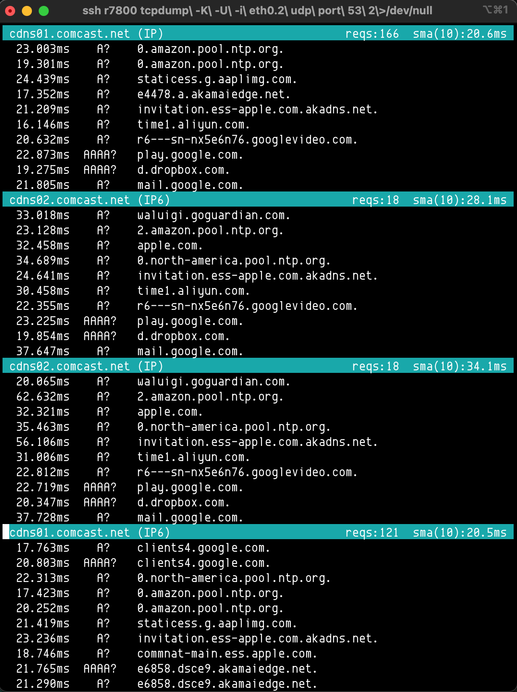

DNS Response Times Monitor
--------------------------------------------------------------------------------
This script parses output from tcpdump (as a continuous stream or as a set amount by adding `-c` to the tcpdump arguments) to show DNS response times in ms for each DNS request ID separated by DNS server and IP version.

##### Example use (continuous stream):
```
ssh r7800 'tcpdump -K -U -i eth0.2 udp port 53 2>/dev/null' | ./DNS_times_parser.py
```

In this example, the interface used in tcpdump is the WAN interface of a Netgear router so dnsmasq cache lookups and any adblock DNS black-holing is bypassed.

##### Test with:
```
cat assets/tcpdump_test.out | ./DNS_times_parser.py
```

##### Columns:
| lookup time delta (ms) | DNS request type | address looked up |
|:----------------------:|:----------------:|:-----------------:|

Output is done using terminal scroll regions - one for each DNS server:



### Regarding Terminal Window Size
There is no terminal window size change callback, so instead any scroll region refresh happens when a new DNS line datum is added.

If the terminal window height is not enough to display scroll regions for all DNS servers, a highlighted ↓ will appear in the first column which means "more scroll regions hidden below". When window height is increased, these are cleared/updated when next line datum is added.

### Requirements
- Python 3.6+ 
- TerminalScrollRegionsDisplay

### Notes
- 1st parser version by Tom D. Aug 2020
- revised by pdanford - Oct 2020
- terminal window scroll regions added by pdanford - Jan 2021

